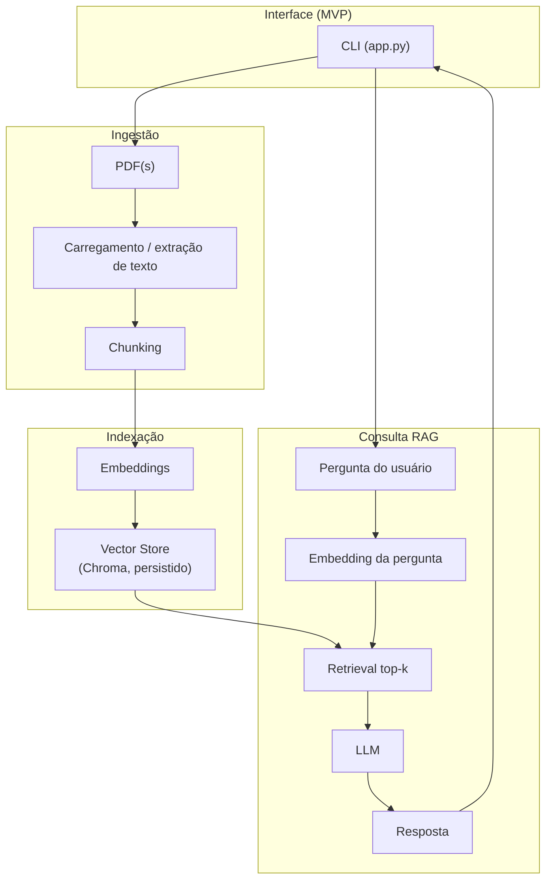

# Arquitetura do sistema — RAG com documentos PDF

## 1. Objetivo deste documento

Descrever, em alto nível, os **componentes** do sistema, o **fluxo de dados** desde o PDF até a resposta do modelo de linguagem, e como essas partes se integram. O desenho prioriza **simplicidade** e adequação a um contexto acadêmico com execução local.

## 2. Visão geral dos componentes

| Camada | Responsabilidade | Tecnologias de referência |
|--------|------------------|---------------------------|
| **Interface (uso)** | No MVP atual: **CLI** (`app.py`) para indexação e perguntas; em evolução futura: UI (ex.: Streamlit) | CLI (Python) |
| **Orquestração RAG** | Encadeamento de carregamento, divisão em chunks, embeddings, armazenamento vetorial, recuperação e geração | LangChain |
| **Carregamento de documentos** | Extração de texto dos PDFs e conversão em documentos estruturados | PyPDF, loaders LangChain |
| **Chunking** | Segmentação do texto em unidades indexáveis com sobreposição | Text splitters LangChain |
| **Embeddings** | Vetorização semântica dos chunks | API de embeddings (ex.: OpenAI via `langchain-openai`) |
| **Vector store** | Persistência e busca por similaridade | ChromaDB (persistência local) |
| **LLM** | Geração da resposta condicionada ao contexto recuperado | API de chat/completion (ex.: OpenAI) |
| **Configuração** | Credenciais e parâmetros sem hard-code | `.env`, `python-dotenv` |

## 3. Fluxo de dados (upload → resposta)

1. **Entrada:** o usuário disponibiliza PDFs em disco (ex.: `data/pdfs/`) ou aponta um diretório via CLI/config; em uma UI futura, haverá upload pelo navegador.
2. **Load:** o módulo de carregamento lê os bytes do PDF e extrai texto; cada fonte vira um ou mais `Document` com metadados (ex.: `source`, página).
3. **Split:** o texto é dividido em **chunks** com tamanho e *overlap* definidos; cada chunk mantém metadados herdados.
4. **Embed:** cada chunk é enviado ao serviço de **embeddings**; o vetor resultante é a representação semântica do trecho.
5. **Index:** embeddings + texto + metadados são gravados no **vector store** (Chroma), com persistência em disco para reutilização entre execuções.
6. **Query:** a pergunta do usuário é convertida no mesmo espaço de embedding (mesmo modelo).
7. **Retrieve:** o vector store retorna os **k** chunks mais similares (*top-k*).
8. **Generate:** o LLM recebe um prompt que inclui os trechos recuperados e a pergunta; gera a **resposta final**.

Em versões com melhoria de qualidade, a UI pode exibir os trechos recuperados para **auditoria** e redução de alucinações.

## 4. Diagrama de arquitetura (Mermaid)

## 5. Integração entre componentes (detalhe conciso)

### 5.1 Carregamento de documentos

Transforma arquivos PDF em sequências de texto utilizáveis. A saída deve ser compatível com o pipeline LangChain (documentos com `page_content` e `metadata`). Falhas (PDF vazio ou ilegível) devem ser tratadas antes do chunking.

### 5.2 Chunking

Controla o **granularity vs. contexto**: chunks grandes preservam contexto mas podem diluir a similaridade; chunks pequenos melhoram precisão pontual mas podem perder referências. Parâmetros típicos: tamanho máximo, sobreposição e, se aplicável, separadores hierárquicos (parágrafos).

### 5.3 Embeddings

O mesmo **modelo de embedding** deve ser usado na indexação e na consulta para garantir comparabilidade dos vetores. O vector store armazena vetores normalizados conforme a implementação do backend escolhido.

### 5.4 Vector store

Chroma atua como **repositório de vetores + metadados**, permitindo consultas por similaridade e persistência local (`persist_directory`). Alternativas podem ser adotadas desde que a interface de recuperação permaneça isolada em um módulo fino.

### 5.5 LLM

Recebe prompt estruturado: instruções do sistema (uso exclusivo do contexto), blocos de texto recuperados e pergunta. Temperatura e *top-k* afetam criatividade versus aderência ao texto fonte.

### 5.6 Interface / ponto de entrada (MVP)

No MVP atual, o **`app.py` (CLI)** orquestra o fluxo: disparar indexação opcional quando solicitado (`--index`), enviar pergunta ao *retriever* + *chain* e imprimir resultado (incluindo lista de citações). Evoluções futuras (Streamlit/web) devem apenas **consumir** os mesmos serviços, sem duplicar regra de negócio.

## 6. Limitações conscientes do desenho

- Dependência de **API externa** para embeddings e LLM (disponibilidade e custo).
- Qualidade da extração de PDF limitada pela biblioteca e pelo formato do arquivo (texto vs. imagem).
- Escalabilidade horizontal não é requisito do MVP; um único processo e armazenamento local são suficientes.

## 7. Referências internas

- Escopo do MVP: `escopo-mvp.md`
- Planejamento por releases: `backlog.md`
